# _**Self-hosted Malware Analysis Lab**_

Neste guia, vamos configurar um ambiente de análise de malware totalmente isolado utilizando o <mark>VirtualBox</mark> como _hypervisor_  
O objetivo é criar duas máquinas virtuais, uma com **Windows 10 Enterprise** para executar amostras maliciosas, e outra com *REMnux* para atuar como servidor C2 e fornecer serviços simulados  

Todo o ambiente será configurado em uma rede _host-only_, sem acesso à Internet, garantindo segurança e controle durante as análises  
Acompanhe os passos a seguir para preparar seu laboratório de forma eficiente e segura  

Primeiramente, vamos realizar o download do nosso Hypervisor
Para esse projeto, irei utilizar [VirtuaBox](https://www.virtualbox.org/)  
Como dito previamente, iremos configurar duas VMs:
* **VM1: Windows10 Enterprise para execução do malware**
* **VM2: Servidor C2 com REMnux**

Estas duas máquinas virtuais estarão completamente isoladas da Internet, podendo comunicar-se entre si e apenas entre si

## _**Preparação**_
Primeiro, vamos realizar o download do [Windows 10 Enterprise](https://www.microsoft.com/pt-br/evalcenter/download-windows-10-enterprise)  
Para obter o arquivo _.ISO_, basta preencher com qualquer informação  
Em seguida, escolher sua opção  
Para este projeto, nós iremos com <mark>Português-BR 64-bits</mark>  
Basta clicar em _download_  

Segundo, vamos realizar o download do [REMnux](https://docs.remnux.org/install-distro/get-virtual-appliance)  
No link, procure por VirtualBox OVA  
Clique no link para download  

## _**Criando a própria rede no VirtualBox**_
Para conseguirmos comunicação e isolamento entre as máquinas virtuais, devemos criar nossa própria rede  
Através dos passos abaixo, podemos completar essa etapa e criar uma _host-only_  
No aplicativo VirtualBox:
* **ctrl + h**
* **clique em _criar_**
* **altere o endereço IP para: _10.0.0.1_**

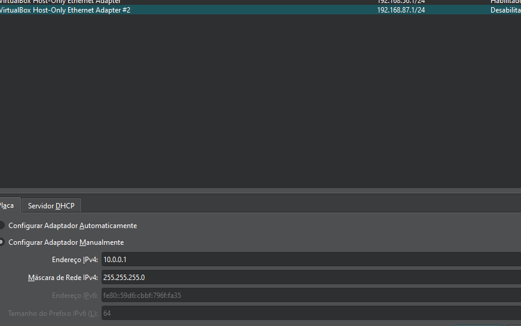  
* habilite o servidor DHCP realizando as alterações de endereço IP caso necessário  

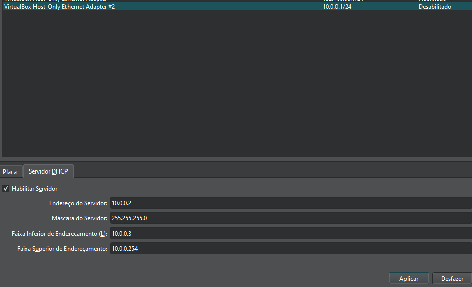  

Isso vai permitir com que REMnux e a nossa máquina Windows Enterprise se comuniquem entre si e apenas entre si, sem acesso a Internet

## _**Instalando e configurando o REMnux**_
Após a conclusão do download, abra o aplicativo VirtualBox  
Para configurarmos no VirtualBox, devemos ir em: <mark>Arquivo --> Import Appliance</mark>  
Em seguida, designar o path correto com nosso arquivo _.OVA_  
Basta cliclar em _**iniciar**_
Caso necessário, é possível alterar a quantidade de memória RAM e CPUs alocados para esta máquina  

No terminal do REMnux, vamos executar as seguintes linhas de comando e alterar os seguintes trechos de arquivo:
> ```bash
> cd /etc/inetsim
> ```
> ```bash
> sudo nano inetsim.conf
> ```

Retire _**#**_ de: _**start_service_dns**_
Retire _**#**_ de: _service_bind_address_ e altere o endereço IP para 0.0.0.0  

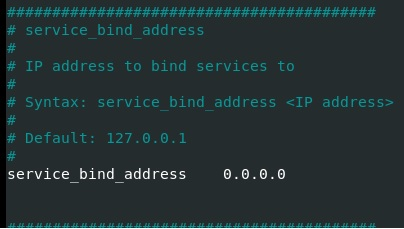  

Retire _**#**_ de: _dns_default_ip_ e altere o endereço IP para 10.0.0.4  

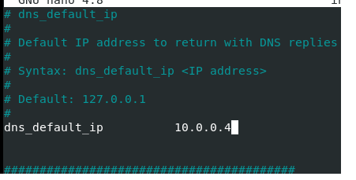  

**Mantenha a máquina ligada por enquanto**

## Instalando e configurando o Windows 10 Enterprise
Vamos criar uma máquina com o arquivo _.ISO_ do Windows  

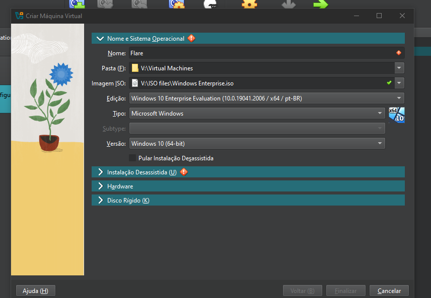

Realize as configurações necessárias de usuário  

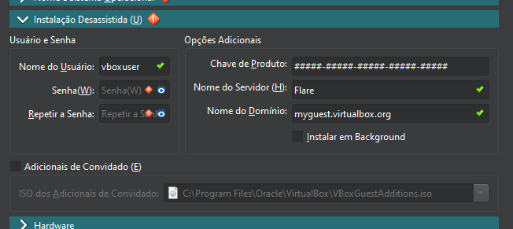

Para completarmos nossa configuração do Windows base, vamos utilizar:
* Memória RAM: 4GB
* Cores: 4
* Espaço em disco mínimo: 70GB  

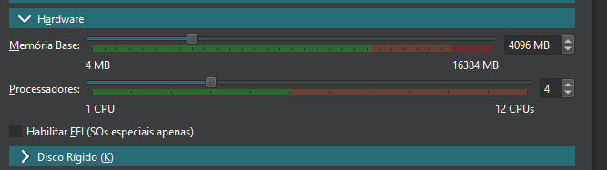  

Após iniciar a máquina, nosso primeiro passo será desabilitar algumas funções
Primeiro, vamos desabilitar o **Windows Defender**  


Segundo, vamos desabilitar o **Firewall** tanto para perfil de domínio quanto para perfil padrão
Para acessar a área de registros, procure por <mark>editor de política de grupo</mark> na bara de pesquisa  

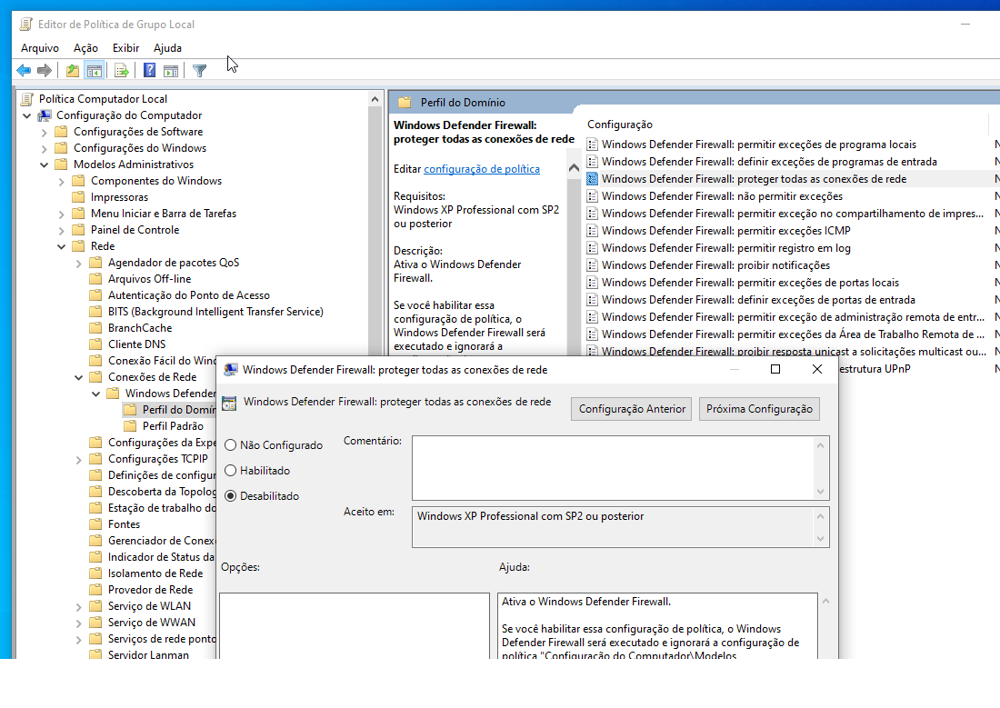

Por fim, vamos desabilitar definitivamente o **Windows Defender**  

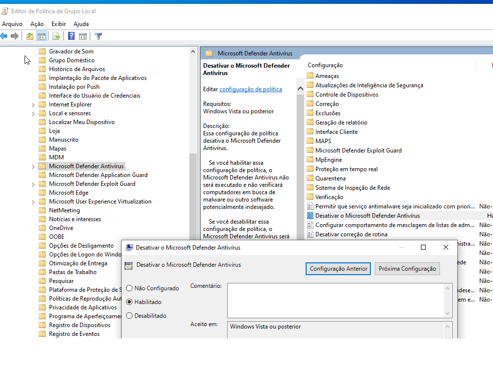  

Agora, para a nossa próxima etapa, vamos realizar o donwload de um Web-Browser  
Para este, estaremos utilizando o [Chrome](https://www.google.com/intl/pt-BR/chrome/)

## _**Instalando Flare**_
Para esta etapa, vamos utilizar **Powershell**  
Abra com permissões de administrador  
A instalação do Flare começa com a lista de comandos abaixo:
> ```bash
> cd C:\Users\[username]\Desktop
> ```
> ```bash
> (New-Object net.webclient).DownloadFile('https://raw.githubusercontent.com/mandiant/flare-vm/main/install.ps1',"$([Environment]::GetFolderPath("Desktop"))\\install.ps1")
> ```

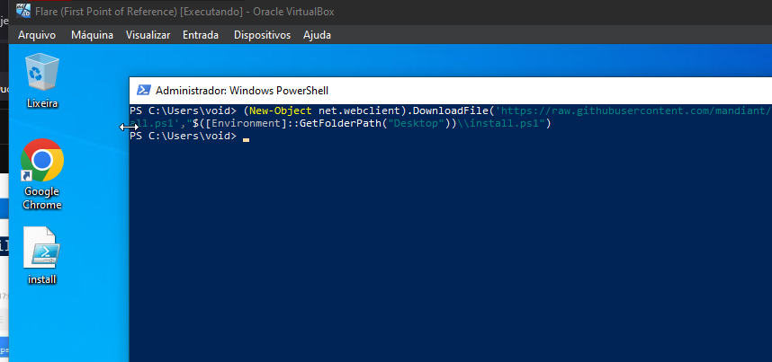  

> ```bash
> Unblock-File .\install.ps1
> ```
> ```bash
> Set-ExecutionPolicy Unrestricted | Selecione _sim_
> ```
> ```bash
> .\install.ps1
> ```

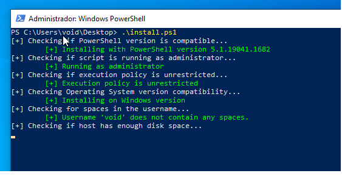  

A instalação pode ser demorada, por isso, tenha paciência  

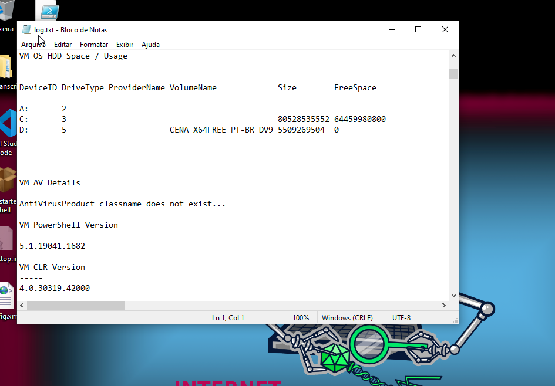

## _**Toques finais**_
A última configuração a ser feita é garantir a conexão entre as nossas máquinas  
Na máquina Windows, vá para: <mark>máquina --> configurações --> rede</mark>  
Selecione _host-only_  
E coloque o _card_ de rede criado anteriormente no VirtualBox  
Iremos fazer o mesmo com o terminal REMnux  
Por fim, vamos alterar o DNS da máquina com o Windows Enterprise  

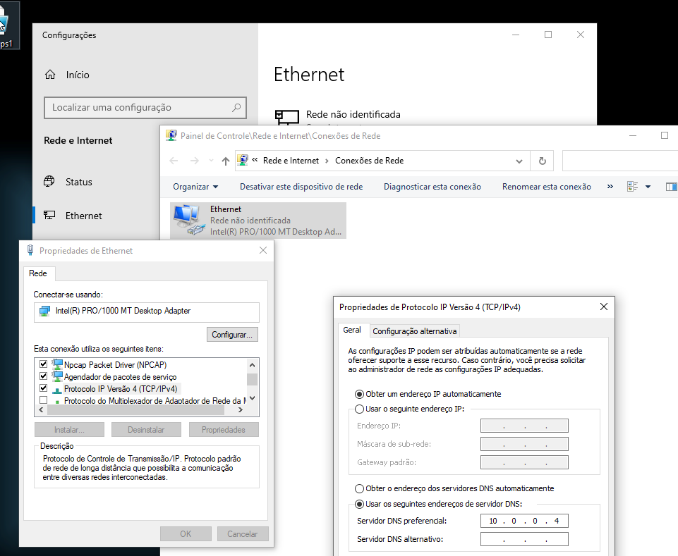

Para garantir que todas as configurações de rede estão corretas, vamos usar o comando ping  

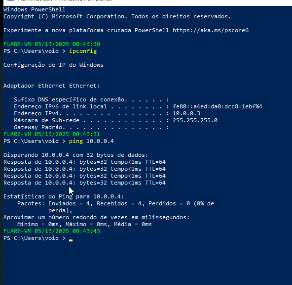  

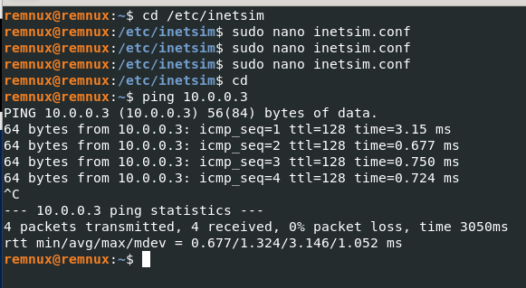  

Agora, tire _snapshots_ de cada uma das máquinas como ponto de partida para futuros projetos

## _**Conclusão**_
Com todas as configurações concluídas, temos agora um ambiente funcional e seguro para análise de malware  
As máquinas virtuais estão isoladas da Internet, mas podem se comunicar entre si, permitindo o monitoramento e controle do comportamento de amostras maliciosas  
A utilização de snapshots garante a facilidade de reverter alterações e reutilizar a estrutura em projetos futuros  
Esse laboratório serve como uma base sólida para experimentos, treinamentos ou pesquisas na área de segurança cibernética  
