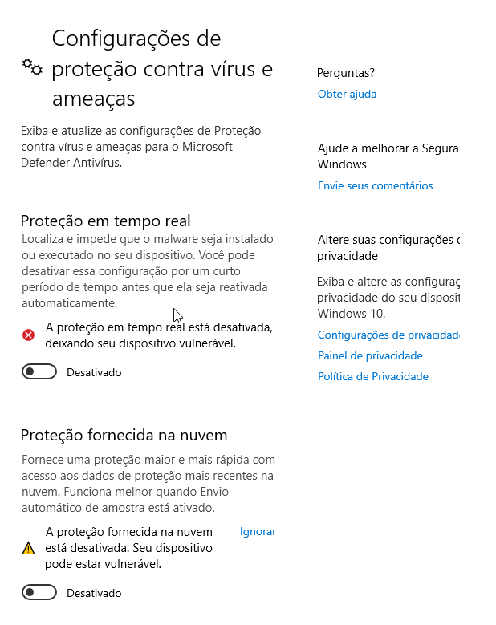

# _**Self-hosted Malware Analysis Lab**_
Neste guia, vamos configurar um ambiente de análise de malware totalmente isolado utilizando o VirtualBox como hypervisor
O objetivo é criar duas máquinas virtuais — uma com Windows 10 Enterprise para executar amostras maliciosas e outra com REMnux para atuar como servidor C2 e fornecer serviços simulados
Todo o ambiente será configurado em uma rede host-only, sem acesso à Internet, garantindo segurança e controle durante as análises
Acompanhe os passos a seguir para preparar seu laboratório de forma eficiente e segura

Primeiramente, vamos realizar o download do nosso Hypervisor
Para esse projeto, irei utilizar [VirtuaBox](https://www.virtualbox.org/)

Como dito previamente, iremos configurar duas VMs:
* VM1: Windows10 Enterprise para execução do malware
* VM2: Servidor C2 com REMnux

Estas duas máquinas virtuais estarão completamente isoladas da Internet, podendo comunicar-se entre si e apenas entre si

## Preparação
Primeiro, vamos realizar o download do [Windows 10 Enterprise](https://www.microsoft.com/pt-br/evalcenter/download-windows-10-enterprise)
Para obter o arquivo .ISO, basta preencher com qualquer informação
Em seguida, escolher sua opção
Para este projeto, nós iremos com Português-BR 64-bits
Basta clicar em download

Segundo, vamos realizar o download do [REMnux](https://docs.remnux.org/install-distro/get-virtual-appliance)
No link, procure por VirtualBox OVA
Clique no link para download

## Criando a própria rede no VirtualBox
Através dos passos abaixo, podemos criar nossa própria rede (host-only) para as duas VMs
* ctrl + h
* clique em _criar_
* altere o endereço IP para: 10.0.0.1

* habilite o servidor DHCP realizando as alterações de endereço IP caso necessário

Isso vai permitir com que REMnux e a nossa máquina Windows Enterprise se comuniquem entre si e apenas entre si, sem acesso a Internet

## Instalando e configurando o REMnux
Após a conclusão do download, abra o aplicativo VirtualBox
Para configurarmos no VirtualBox, devemos ir em: Arquivo --> Import Appliance
Em seguida, designar o path correto com nosso arquivo .OVA
Após, basta cliclar em _**iniciar**_

Caso necessário, é possível alterar a quantidade de memória RAM e CPUs alocados para esta máquina

No terminal do REMnux, vamos executar as seguintes linhas de comando e alterar os seguintes trechos de arquivo:
* cd /etc/inetsim
* sudo nano inetsim.conf
* retire o _**#**_ de: start_service_dns
* retire o _**#**_ de: service_bind_address e altere o endereço IP para 0.0.0.0

* retire o _**#**_ de: dns_default_ip e altere o endereço IP para 10.0.0.4

Mantenha a máquina ligada por enquanto

## Instalando e configurando o Windows 10 Enterprise
Vamos criar uma máquina com o arquivo .ISO do Windows

Realize as configurações necessárias de usuário

Para completarmos nossa configuração do Windows base, vamos utilizar:
* Memória RAM: 4GB
* Cores: 4
* Espaço em disco mínimo: 70GB

Após iniciar a máquina, nosso primeiro passo será desabilitar algumas funções
Primeiro, vamos desabilitar o Windows Defender

Segundo, vamos desabilitar o Firewall tanto para perfil de domínio quanto para perfil padrão
Para acessar a área de registros, procure por <mark>editor de política de grupo</mark> na bara de pesquisa

Por fim, vamos desabilitar definitivamente o Windows Defender

Agora, para a nossa próxima etapa, vamos realizar o donwload de um Web-Browser
Para este, estaremos utilizando o [Chrome](https://www.google.com/intl/pt-BR/chrome/)

## Instalando Flare
Para esta etapa, vamos utilizar Powershell
Abra com permissões de administrador
A instalação do Flare começa com a lista de comandos abaixo:
* cd C:\Users\[username]\Desktop
* (New-Object net.webclient).DownloadFile('https://raw.githubusercontent.com/mandiant/flare-vm/main/install.ps1',"$([Environment]::GetFolderPath("Desktop"))\\install.ps1")

* Unblock-File .\install.ps1
* Set-ExecutionPolicy Unrestricted | Selecione _sim_
* .\install.ps1

A instalação pode ser demorada, por isso, tenha paciência

## Toques finais
A última configuração a ser feita é garantir a conexão entre as nossas máquinas
Na máquina Windows, vá para máquina --> configurações --> rede
Selecione host-only
E coloque o _card_ de rede criado anteriormente no VirtualBox
Iremos fazer o mesmo com o terminal REMnux
Por fim, vamos alterar o DNS da máquina com o Windows Enterprise

Para garantir que todas as configurações de rede estão corretas, vamos usar o comando ping

Agora, tire snapshots de cada uma das máquinas como ponto de partida para futuros projetos

## Conclusão
Com todas as configurações concluídas, temos agora um ambiente funcional e seguro para análise de malware
As máquinas virtuais estão isoladas da Internet, mas podem se comunicar entre si, permitindo o monitoramento e controle do comportamento de amostras maliciosas
A utilização de snapshots garante a facilidade de reverter alterações e reutilizar a estrutura em projetos futuros
Esse laboratório serve como uma base sólida para experimentos, treinamentos ou pesquisas na área de segurança cibernética
